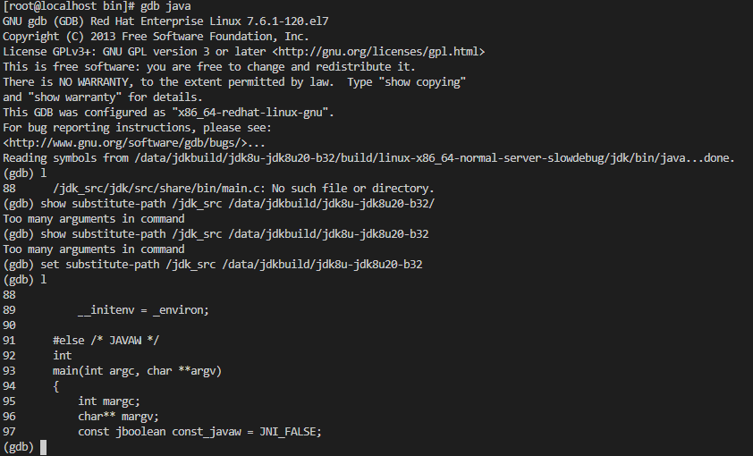
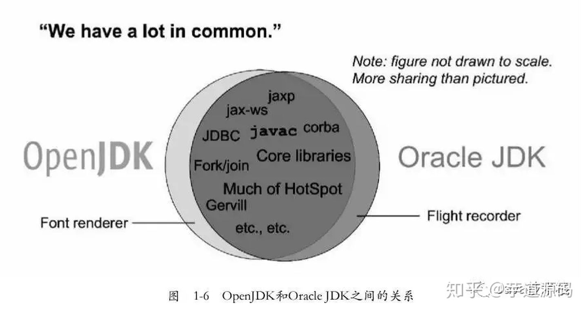

# OPENJDK8编译用Docker

## 简介

OpenJDK8的Docker编译环境

## 测试过的版本

只测试了两个版本

[jdk8u292-b01](https://github.com/openjdk/jdk8u/tree/jdk8u292-b01)

[jdk8u20-b32](https://github.com/openjdk/jdk8u/tree/jdk8u20-b32)

## JDK源码下载

需要自行下载需要编译的版本

在Github项目[https://github.com/openjdk/jdk8u](https://github.com/openjdk/jdk8u)，选择相应版本的tag,直接"Download Code"即可。

也可以在官方源码站[https://hg.openjdk.java.net/jdk8u](https://hg.openjdk.java.net/jdk8u)进行下载，不过需要合并不同子项目的源码，相对麻烦。


## 使用
```bash
docker build . -t jdk8u_build_16.04
#解压jdk源码源码后执行
docker run -it -v [jdk源码路径]:/jdk_src jdk8u_build_16.04
# 如果需要fastdebug版本，加上环境变量参数-e debug_level=fastdebug
docker run -it -v [jdk源码路径]:/jdk_src -e debug_level=fastdebug jdk8u_build_16.04
```
编译完成后，源码的build目录中就是编译的结果

## 调试

直接gdb启动即可，如果l的时候提示No such file or directory。

执行`set substitute-path /jdk_src [jdk源码路径]`,重新设置源码路径即可。



## 有关OpenJDK与OracleJDK的关系

OpenJDK是Sun在2006年末把Java开源而形成的项目.

OpenJDK采用GPL V2协议发布，而JDK则采用JRL协议发布。两个协议虽然都是开放源代码的，但是在使用上的不同在于GPL V2允许在商业上使用，而JRL只允许个人研究使用。

在JDK7的时候，OpenJDK已经成为JDK7的主干开发版，SUN JDK7是在OpenJDK7的基础上发布的，其大部分源码都相同，只有少部分源码被替换掉。使用JRL(Java Research License，Java研究授权协议)发布。

Oracle的项目发布经理Joe Darcy在OSCON 2011上对两者关系的介绍也证实了OpenJDK 7和Oracle JDK 7在程序上是非常接近的，两者共用了大量相同的代码：



根据Oracle的官方说法，在Java11 之后，OracleJDK和OpenJDK的功能基本一致，之前OracleJDK中的私有组件大多数也已经被捐赠给开源组织，现在它们之间只有少量区别。

Oracle/Sun JDK里面包含的JVM是HotSpotVM，HotSpot VM只有非常非常少量的功能没有在OpenJDK里，那部分在Oracle内部的代码库里。这些私有部分都不涉及JVM的核心功能。所以说，Oracle/Sun JDK与OpenJDK其实使用的是同一个代码库。

从一个Oracle内部员工的角度来看，当他要构建OracleJDK时，他同样需要先从http://hg.openjdk.java.net签出OpenJDK，然后从Oracle内部的代码库签出私有的部分，放在OpenJDK代码下的一个特定目录里，然后构建。

不过，Oracle JDK只发布二进制安装包，而OpenJDK只发布源码。


## 其他说明

1. 在测试编译8u20的时候，需要使用低版本的make，这里我用的是make3.8.1

2. Docker环境下需要手工指定freetype的位置,编译脚本里已经写好了

3. jdk8u20源码没有`--with-native-debug-symbols`没有这个选项，脚本中做了一个判断。

4. 感谢phith0n师傅给的指导，之前编译jdk8u20好久都没编译过去，Docker太香了。


## 引用
有关OracleJDk和OpenJDK之间的关系:

[https://blog.csdn.net/lsx2017/article/details/81273548](https://blog.csdn.net/lsx2017/article/details/81273548)

[https://www.zhihu.com/question/353325963/answer/1164720909](https://www.zhihu.com/question/353325963/answer/1164720909)

[https://blogs.oracle.com/java-platform-group/orace-jdk-releases-for-java-11-and-later](https://blogs.oracle.com/java-platform-group/orace-jdk-releases-for-java-11-and-later)

[https://zhuanlan.zhihu.com/p/108675511](https://zhuanlan.zhihu.com/p/108675511)

有关OpenJDK的编译：

[https://blog.ldkxingzhe.top/2019/10/15/openjdk-compile-and-debug-with-clion/](https://blog.ldkxingzhe.top/2019/10/15/openjdk-compile-and-debug-with-clion/)

[https://yddmax.github.io/2017/06/12/openjdk8%E4%B9%8B%E7%BC%96%E8%AF%91%E5%92%8Cdebug/](https://yddmax.github.io/2017/06/12/openjdk8之编译和debug/)

[https://askubuntu.com/questions/1235819/ubuntu-20-04-gcc-version-lower-than-gcc-7](https://askubuntu.com/questions/1235819/ubuntu-20-04-gcc-version-lower-than-gcc-7)

[https://blog.csdn.net/desiyonan/article/details/80802066](https://blog.csdn.net/desiyonan/article/details/80802066)